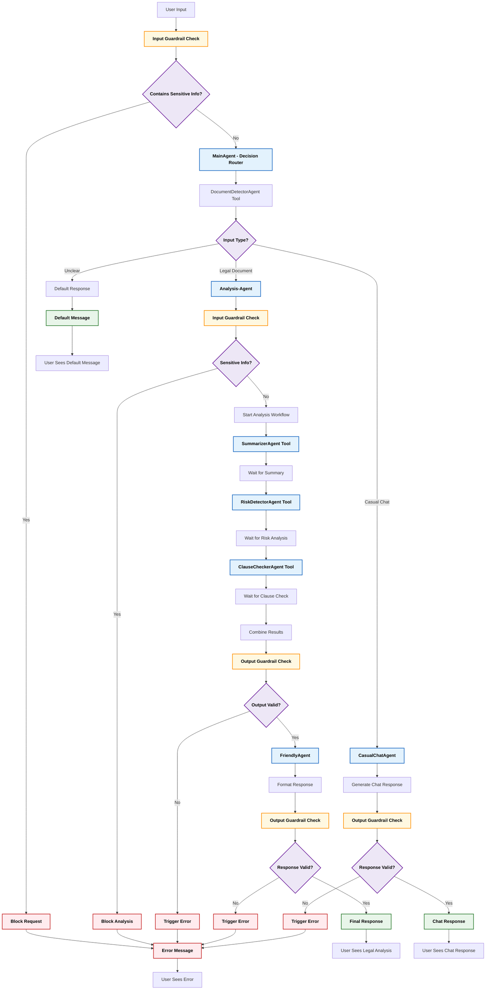

# Legalyze AI — Backend

FastAPI service that powers document analysis for [Legalyze AI](../README.md). It's a stateless-ish analysis engine: the Next.js app owns auth, sessions, rate-limiting policy, and persistence, and calls this service over HTTP for the actual AI work.

## Overview

Built with a modular **multi-agent architecture** on top of the OpenAI Agents SDK, this service:

- Detects whether an upload is a legal document worth analyzing
- Extracts real text from `.txt`, `.pdf`, and `.docx` uploads (`utils/file_processor.py`)
- Summarizes the document, flags risky clauses, and returns a safe/unsafe verdict
- Caches results in Redis (keyed by document hash) so identical documents skip the LLM
- Rate-limits the public demo endpoint per-IP via Redis

---

## Project Setup

### Prerequisites

- Python ≥ 3.12
- [`uv`](https://github.com/astral-sh/uv) (fast Python package/dependency manager)

Install `uv` if you don't have it:

```bash
# Linux/macOS:
curl -LsSf https://astral.sh/uv/install.sh | sh

# Windows (PowerShell):
powershell -c "irm https://astral.sh/uv/install.ps1 | iex"
```

### Installation

```bash
cd backend
uv sync
```

`uv sync` reads `pyproject.toml`/`uv.lock` and creates `.venv` with all dependencies pinned — no `requirements.txt` involved.

### Environment Variables

Create a `.env` file in `backend/`:

```env
# Required — main analysis pipeline
OPENAI_API_KEY="sk-..."

# Required — powers the public /demo/ endpoint
OPEN_ROUTER_KEY="sk-or-..."

# Optional — result caching + demo rate limiting. If unset, the app runs in
# degraded mode: no caching, and the demo endpoint is unthrottled.
REDIS_HOST="localhost"
REDIS_PORT=6379
REDIS_PASSWORD=""
REDIS_USE_SSL=true

# Optional — demo rate limit (defaults shown)
DEMO_RATE_LIMIT_MAX=5
DEMO_RATE_LIMIT_WINDOW_SECONDS=3600

# Optional
DEBUG=false
```

`.env` is already in `.gitignore` — don't commit it.

---

## How to Run

```bash
# Dev server with auto-reload
uv run uvicorn app:app --reload --port 8000

# Or directly (uses host/port from config/settings.py)
uv run python app.py
```

- `GET /` — service info
- `GET /health` — reports cache/rate-limiter connection status and model init state
- `POST /demo/` — public, unauthenticated, rate-limited, no caching or retries (`run_demo_pipeline`)
- `POST /analyze/` — used by the authenticated frontend flow; adds Redis caching and retry logic (`run_enhanced_pipeline_streamed`)

Both endpoints stream results back as Server-Sent Events.

---

## Deployment

This service is deployed to **[FastAPI Cloud](https://fastapicloud.com)**. The `.fastapicloud/` folder (created by linking this directory to a FastAPI Cloud project) holds your local project link and is git-ignored — it's regenerated per-machine, not something to commit or share.

Point the frontend at this service by setting `WEB_URL` (in the Next.js app's environment) to this backend's deployed URL.

---

## Project Flow Diagram



> **Note:** the guardrail stages shown above (`sensitive_input_guardrail`, `final_output_validation_guardrail`, both defined in `core/guardrails.py`) are implemented but not yet attached to `main_agent`/`analysis_agent` in `core/agent_factory.py` — this diagram documents the intended flow, not the currently-running one. Tracked as a known gap, not fixed in this pass.

---

## Flow Explanation

### 1. Input Guardrail (planned — see note above)

Scans input for sensitive data. If found → **blocked**.

### 2. Main Agent — Decision Router

Routes input to the right agent (document analysis vs. casual chat) using `DocumentDetectorAgent`.

### 3. Legal Document Flow

- Runs `SummarizerAgent`, `RiskDetectorAgent`, `ClauseCheckerAgent` as tools of `analysis_agent`
- Combines results into a `FinalOutput` (summary, risks, verdict, disclaimer)

### 4. Casual Chat Flow

- Handled by `main_agent` directly when the input isn't a document

### 5. Errors

- Unsupported/corrupt uploads are rejected fast (400) before any LLM call — see `_extract_text_or_400` in `api.py`
- Pipeline failures return a friendly error message over the SSE stream rather than a raw exception
